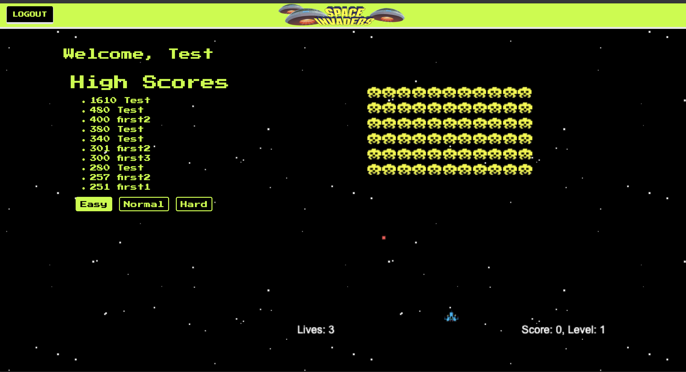

# Space Invaders-UCSD coding Bootcamp Project 2
Second Project for Coding Bootcamp
## Description
  This was a collaborative project for a coding bootcamp. We utilized several technologies including Node, Express, Express-Handlebars, and passport. We used MySQL as our database along with sequelize ORM. We used JAWS DB for deployment to Heroku. 

  The game framework was provided by [Dave Kerr](https://github.com/dwmkerr/spaceinvaders). We made graphical changes to the start and end game screens. We also changed the ship and alien images. 

  ## Gameplay
 

 ## Heroku Deployment
 https://project-two-pat-glenn-amanda.herokuapp.com/

  ## Table of Contents
  * [License](#license)
  * [Installation](#installation)
  * [Tests](#tests)
  * [Usage](#usage)
  * [Contributing](#contributing)
  * [Questions](#questions)
  ## Installation
  ``` npm install ```
    bcryptjs
    dotenv
    express
    express-handlebars
    passport
    node mailer
    mysql
    JawsDB for mysql for heroku deployment
  ## Tests
  ``` npm test ```
  ## Usage
  NA
  ## License
  MIT
  ## Contributing
    (@veryfaye)
    (@maninblack1974)
    (@g-gutierrez)
    (@pmo48)
    (@Timhoyt824)
  ## ScreenShot
  
